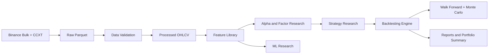

# Bitcoin Quantitative Research Platform

An end-to-end quantitative research repository for **BTCUSDT on Binance Spot**. The purpose is not to advertise a single profitable strategy. The purpose is to demonstrate a reproducible, production-minded research pipeline: data acquisition, validation, feature engineering, alpha research, backtesting, walk-forward validation, Monte Carlo robustness analysis, machine learning research, and documentation.



## Research Scope

- Asset: `BTCUSDT`
- Venue: Binance Spot
- Period: `2020-01-01` through latest available data
- Timeframes: `1m`, `5m`, `1h`, `1d`
- Storage: Parquet
- Philosophy: reusable Python modules first, notebooks second

## Repository Layout

```text
Quant_research/
├── docs/                  # Methodology and architecture notes
├── reports/               # Generated research reports
├── data/                  # Raw, processed, and research Parquet datasets
├── notebooks/             # Lightweight exploratory notebooks
├── src/                   # Reusable production research modules
├── tests/                 # Pytest suite
├── outputs/               # Figures, model artifacts, and run outputs
└── PROJECT_SUMMARY.md     # Final architecture and limitations summary
```

## Installation

This project is compatible with Python 3.12+ and can be managed with `uv`.

```bash
uv venv
uv pip install -e ".[dev]"
```

Poetry users can import the `pyproject.toml` dependencies or run the equivalent editable install in a Poetry-managed environment.

## Usage

Generate a small deterministic offline sample dataset and clearly marked demo reports:

```bash
quant-research demo
```

Download one real Binance historical timeframe, falling back to CCXT when monthly bulk files are not available. The command prints the requested range and final local Parquet coverage:

```bash
quant-research download --symbol BTCUSDT --timeframe 1h --start 2020-01-01 --refresh
```

Download all standard research timeframes for one pair in a single command:

```bash
quant-research download-all --symbol BTCUSDT --timeframes 1m,5m,1h,1d --start 2020-01-01 --refresh
```

Show what local data exists and exactly where each timeframe starts and ends:

```bash
quant-research data-status --symbol BTCUSDT
```

Run the full polished research pipeline on real Binance data:

```bash
quant-research research --symbol BTCUSDT --timeframe 1h --start 2020-01-01 --refresh
```

### Multi-Exchange Data

Download a single timeframe from a supported exchange:

```bash
quant-research download-exchange --exchange nobitex --symbol BTCIRT --timeframe 1d --start 2024-01-01 --refresh
```

Download all standard timeframes for one exchange/symbol:

```bash
quant-research download-exchange-all --exchange nobitex --symbol BTCIRT --timeframes 1m,5m,1h,1d --start 2022-03-21 --refresh
```

Inspect local coverage across exchanges and timeframes:

```bash
quant-research data-status --exchange nobitex --symbol BTCIRT
```

Compare multiple local exchange/timeframe datasets:

```bash
quant-research compare-datasets data/processed/binance_BTCUSDT_1d.parquet data/processed/nobitex_BTCIRT_1d.parquet
```

Generate one unified HTML interface across every local dataset and every strategy:

```bash
quant-research research-all --data-dir data/processed --output reports/global_research/index.html
```

Supported exchanges currently include `binance` and `nobitex`. Nobitex OHLCV uses the public UDF history endpoint documented by Nobitex: `GET /market/udf/history`.

Validate a Parquet dataset:

```bash
quant-research validate data/processed/BTCUSDT_1h.parquet --timeframe 1h
```

Run factor research:

```bash
quant-research factors data/processed/BTCUSDT_1h.parquet --horizon 24
```

Backtest a parameterized strategy:

```bash
quant-research backtest data/processed/BTCUSDT_1h.parquet --strategy ema_trend
```

## Methodology

The pipeline intentionally separates concerns:

- `src.data`: Binance bulk downloader, CCXT fallback, incremental Parquet store, and OHLCV schema.
- `src.validation`: data quality checks for missing candles, duplicates, timestamp gaps, malformed rows, and outliers.
- `src.features`: documented feature registry spanning trend, momentum, volatility, volume, market structure, and statistical features.
- `src.factors`: IC, rank IC, conditional returns, decay curves, stability, and factor correlation.
- `src.strategies`: parameterized research strategies with no hardcoded execution assumptions.
- `src.backtesting`: vectorized long/flat backtesting with fees, slippage, execution delay, and professional metrics.
- `src.ml`: time-series-safe model training for return and volatility forecasting.
- `src.analysis`: walk-forward, Monte Carlo, regime, and portfolio research helpers.

## Generated Reports

Reports are written as Markdown plus saved charts where available:

- `reports/data_quality/`
- `reports/factor_research/`
- `reports/backtests/`
- `reports/walk_forward/`
- `reports/monte_carlo/`
- `reports/ml/`
- `reports/portfolio/`

## Quality Gates

```bash
ruff check .
mypy src
pytest
```

## Roadmap

- Add exchange microstructure features from trades and order book snapshots.
- Add Bayesian optimization for strategy parameter search.
- Add online feature store metadata.
- Add HMM regime detection when `hmmlearn` is available.
- Add GitHub Actions for scheduled data refresh and report publishing.

## Disclaimer

This repository is research infrastructure. It is not financial advice and does not claim live profitability.

